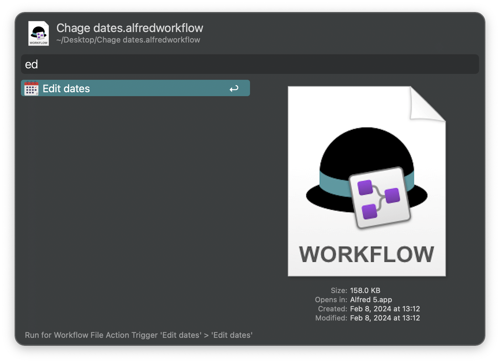
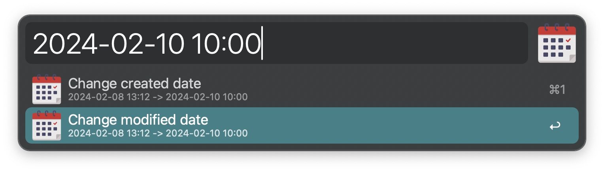

#  Edit Dates Alfred Workflow

Alfred Universal Action workflow for edit file's created or modified date.

## Installation
Download from releases page. Run workflow file and proceed with Alfred configuration.

## Usage
Change a file's created or nodified dates using [Universal Action](https://www.alfredapp.com/help/features/universal-actions/).

Press <kbd>⌘</kbd><kbd>↩</kbd> at any state to reopen the Universal Actions panel after renaming.

Also hotkey may be assigned to trigger action for file focused in Finder.

### Icon
[Calendar icons created by pojok d - Flaticon](https://www.flaticon.com/free-icons/calendar)
